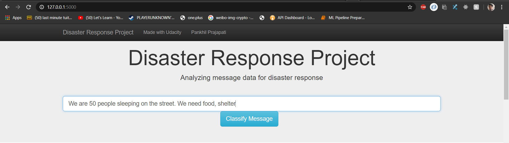
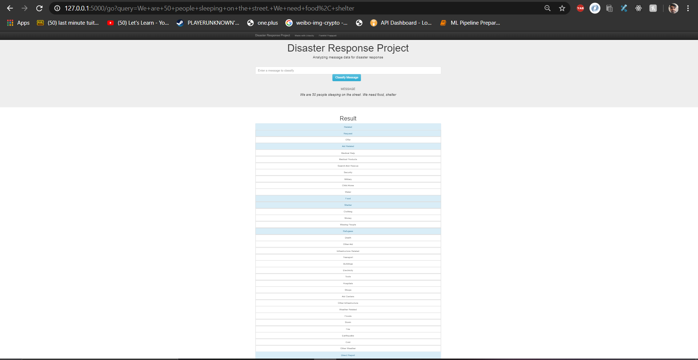

# Disaster Response Pipeline Project

### Motivation
This data is provided by the Figure-eight for the udacity Data Science NanoDegree 

### Instructions:

- All the Analysis done with ETL, ML pipeline and visuals all notebooks are inside EDA

Steps For Installation 

1. Git Clone the Repo

2. Install the requirement using pip installation or
use Anaconda distribution and install using conda

3. Run the following commands in the project's root directory to set up your database and model.

    - To run ETL pipeline that cleans data and stores in database
        `python data/process_data.py data/disaster_messages.csv data/disaster_categories.csv data/DisasterResponse.db`
    - To run ML pipeline that trains classifier and saves
        `python models/train_classifier.py data/DisasterResponse.db models/classifier.pkl`

4. Run the following command in the app's directory to run your web app.
    `python run.py`

5. Go to http://127.0.0.1:5000/

## Authors

* [Pankhil Prajapti](https://github.com/pankhilprajapati)

## License

## Acknowledgements

* [Udacity](https://www.udacity.com/) for providing such a complete Data Science Nanodegree Program
* [Figure Eight](https://www.figure-eight.com/) for providing messages dataset to train my model

## Screenshots

1. This is an example of a message you can type to test Machine Learning model performance

2. After clicking **Classify Message**, you can see the categories which the message belongs to highlighted in green

3. The main page shows some graphs about training dataset, provided by Figure Eight

-

-

-

-

